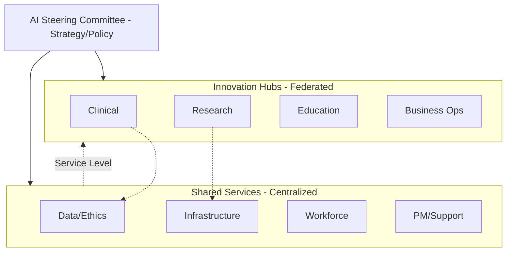

I will research peer AMC governance frameworks, operationalization strategies for AI values, and the structure of institutional AI governance bodies to build a comprehensive dossier for `values.qmd` and `framework.qmd`.

This research dossier provides the evidentiary foundation for the "Values, Principles, and Institutional Governance Framework" chapters of the Quarto book. It synthesizes current (2024–2026) peer institution practices, regulatory mandates, and organizational evidence.

---

## 1. Argument spine

### `values.qmd`: From Aspiration to Operation
Institutional values for AI are "cheap talk" unless they are anchored in specific governance triggers. The chapter argues that the differentiator among AMCs is not *which* values they list (as most converge on the same ethical pillars) but *how* those values are enforced. The argument moves from the "What" (Principles) to the "How" (Checkpoints). 
*   **Key premise:** A value (e.g., Transparency) is only realized when it becomes a mandatory disclosure (e.g., the ONC HTI-1 31 source attributes).
*   **Evidence base:** UCSF’s tri-level checkpoint system and Duke’s ABCDS registry provide the "proof of work" for operationalized ethics.

### `framework.qmd`: The Matrix as a Hybrid Federated Model
The 4-domain × 5-workstream matrix is presented as a structural solution to the "Federated vs. Unified" governance debate. It rejects the inefficiency of total decentralization and the bottleneck of total centralization.
*   **Key premise:** AMCs are "federations of domains" (Clinical, Research, Education, Business) that require domain-specific autonomy for use-case decisions, but "shared-service workstreams" for high-risk infrastructure (Data, Ethics, PM).
*   **Evidence base:** Current survey data (CHIME/Censinet 2025) showing that while 84% of health systems have AI committees, only 59% have robust intake processes—the matrix is the missing "process architecture" to bridge this gap.

---

## 2. Section outline

### `values.qmd`: Principles in Practice
1.  **The Convergence of AI Ethics:** Summary of the "Universal Principles" (Safety, Equity, Transparency, Accountability).
2.  **Peer Playbooks (The Gold Standards):**
    *   **UCSF Health AI Oversight:** The three mandatory checkpoints (Data, Pilot, Deployment).
    *   **Duke Health ABCDS:** Treating algorithms as clinical assets with lifecycle validation.
    *   **Mayo Clinic Platform:** "Validation-as-a-service" and the AI Nutrition Label.
3.  **Operationalizing the Pillars:**
    *   **Transparency:** Beyond the Model Card—ONC HTI-1's 31 attributes as a clinical requirement.
    *   **Equity:** The Badal Framework—moving from bias-checking to Equity-by-Design.
    *   **Human Oversight:** Mitigating "Automation Complacency" through WHO's Human-in-Command principles.
4.  **The Accountability Gap:** How AMCs handle liability and BAA negotiations (Zero-Data-Retention).

### `framework.qmd`: The Institutional Matrix
1.  **The 4-Domain Reality:** Why Clinical, Research, Education, and Business require different risk profiles and funding models.
2.  **The Cross-Cutting Workstreams:** Defining the shared services (Infrastructure, Data, Ethics/ELSI, Workforce, PM/Support).
3.  **The Hybrid Governance Model:**
    *   **Centralized "Red Lines":** Security, Legal, Ethics.
    *   **Federated "Innovation Hubs":** Domain-specific deployment.
4.  **The AI Steering Committee (AISC):** Membership, reporting lines (CEO vs. CIO), and decision rights.
5.  **Evidence for the Matrix:** Literature on shared services in healthcare technology and the pitfalls of siloed "Shadow AI."

---

## 3. Annotated source list

*   **HHS Trustworthy AI (TAI) Playbook (2021/2024 update).** *U.S. Dept of Health and Human Services.* [Link](https://www.hhs.gov/sites/default/files/hhs-trustworthy-ai-playbook.pdf). 
    *   **Annotation:** The foundational framework adopted by UCSF. Defines 6 core principles. Crucial for showing how government standards become the baseline for AMC policy.
    *   **Reliability:** [Regulatory-primary]

*   **Bedoya et al. (2022). "A framework for the oversight and local deployment of safe and high-quality prediction models."** *JAMIA.* [DOI: 10.1093/jamia/ocac014](https://doi.org/10.1093/jamia/ocac014).
    *   **Annotation:** The definitive primary source for Duke Health's ABCDS committee structure. Details the 4-phase lifecycle (Silent, Effectiveness, etc.) and the registry requirement.
    *   **Reliability:** [Peer-reviewed]

*   **Badal et al. (2023). "Operationalizing Health Equity in Health AI."** *Lancet Digital Health.* [Link](https://www.thelancet.com/journals/landig/article/PIIS2589-7500(23)00155-4/fulltext).
    *   **Annotation:** Provides the "Badal Framework" for Equity-by-Design. Argues for recurring local validation rather than one-time external checks.
    *   **Reliability:** [Peer-reviewed]

*   **CHIME/Censinet (Dec 2025). "The State of AI Governance in Healthcare."** *Annual Survey Report.* [Reference](https://www.censinet.com).
    *   **Annotation:** Provides the 2025 statistic that 84% of health systems have AI committees, but only 25% include ethics roles. Essential for the "gap analysis" in the book.
    *   **Reliability:** [Professional-society]

*   **ONC HTI-1 Final Rule (2024). "Decision Support Interventions Criterion."** *HealthIT.gov.* [Link](https://www.healthit.gov/topic/laws-regulation-and-policy/health-data-technology-and-interoperability-hti-1).
    *   **Annotation:** Lists the 31 source attributes for Predictive DSIs. This is the "teeth" behind the transparency principle in clinical AI.
    *   **Reliability:** [Regulatory-primary]

*   **FUTURE-AI Principles (2025). "Consensus guideline for trustworthy AI in health."** *The BMJ.* [Link](https://www.bmj.com/content/384/bmj-2023-077224).
    *   **Annotation:** An international consensus defining Fairness, Universality, Traceability, Usability, Robustness, and Explainability.
    *   **Reliability:** [Peer-reviewed]

---

## 4. Candidate figures and tables

### Table 1: Peer AMC Governance Frameworks
| Institution | Framework Name | Year | Key Operational Mechanism |
| :--- | :--- | :--- | :--- |
| **UCSF** | TAI Playbook | 2021 | 3-Level Mandatory Checkpoints |
| **Duke Health** | ABCDS Charter | 2022 | Algorithm Registry & Silent Evaluation |
| **Mayo Clinic** | Platform Framework | 2023 | "Validation-as-a-Service" / Nutrition Labels |
| **Vanderbilt** | AVAIL Program | 2024 | REDCap Intake & Dual Subcommittees (AIT/PET) |
| **MGB** | AI Control Plane | 2025 | "Clinical Trial" approach for LLM pilots |

### Table 2: Mapping Principles to Operational Mechanisms
| Principle | Operational Requirement | Responsible Body | Monitoring Mechanism |
| :--- | :--- | :--- | :--- |
| **Transparency** | ONC HTI-1 31 Attributes | AI Governance Comm | Annual Model Card Audit |
| **Equity** | Sub-population Analysis | Data Science/Workgroup | Drift Alerting on Demographic Spikes |
| **Oversight** | Human-in-Loop UI | Clinical Informatics | UX Shadowing / Complacency Surveys |
| **Privacy** | Zero-Data-Retention | Security/CISO | BAA Technical Controls Audit |

### Figure 1: The Governance Architecture (Mermaid)

---

## 5. Open questions for the author

1.  **ISO 42001 Participation:** While ISO 42001 is the "gold standard" for management systems, no U.S. AMC has yet been certified. Should the book advocate for certification or remain with the NIST/CHAI alignment which is the current norm?
2.  **Reporting Lines:** Evidence shows a trend toward AI reporting to the CEO (as a strategic asset). Does the AMC in this book follow the legacy CIO/CMO reporting line or the modern CEO reporting line?
3.  **The "Ethics Gap":** With only 25% of committees including bioethics experts, should we explicitly mandate a "Bioethics Workstream" or keep it within the "Ethics/ELSI" workstream?
4.  **Shadow AI vs. Innovation:** How much "Shadow AI" (unauthorized use) is tolerated in the "Federated" model? This requires an authorial stance on the "red lines" mentioned in the framework.
