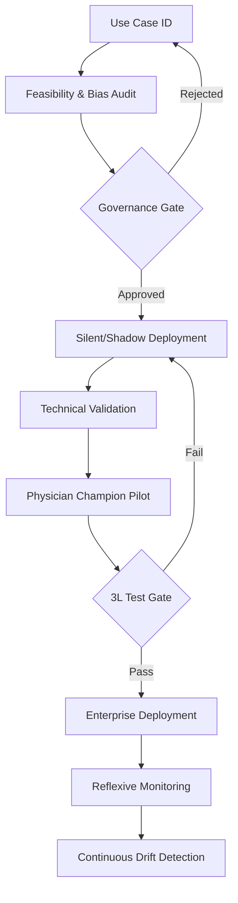

This dossier provides a research-backed foundation for the implementation and adoption chapters of the "Large Language Model Policy and Practice" book.

---

## 1. Argument Spine

### implementation.qmd: "The Domain-Specific Deployment Lifecycle"
**Core Thesis:** Generic change management fails in AMCs because implementation is not a technological event but a sociotechnical integration into specialized professional domains. 
*   **The Domain Divergence:** Clinical domains prioritize **safety and validation** (DECIDE-AI); Research prioritizes **integrity and data provenance** (IRB-AI alignment); Education prioritizes **literacy and assessment validity** (milestone frameworks); Business prioritizes **efficiency and cross-system choreography** (HealthAdminBench).
*   **The IS Framework:** Implementation must move from **Coherence** (sense-making) to **Collective Action** (workload integration) using Normalization Process Theory (NPT) as the engine.
*   **The Success Path:** Success is achieved through a "staged reveal": Silent/Shadow deployment (validation) $\rightarrow$ Physician Champion pilot (social proofing) $\rightarrow$ Full Integration (workflow-embedded).

### barriers.qmd: "Structural Friction and the Integration Tax"
**Core Thesis:** AMCs fail not because of "resistance to change" but because of structural friction—governance vacuums, EHR integration hurdles, and the "Integration Tax" (the hidden labor required to make AI usable).
*   **The Governance Vacuum:** 65% of health systems lack formal AI policies, creating a "permission paradox" where clinicians either wait indefinitely or use "Shadow AI."
*   **The EHR Barrier:** Technical debt in legacy systems and selective FHIR API support create "brittle" implementations that break during vendor updates.
*   **Alert Fatigue as Structural Failure:** 90% override rates for traditional CDS are not a user error; they are an architectural failure. AI must "filter the filter."

---

## 2. Section Outline

### implementation.qmd
1.  **Beyond the Checklist:** Why generic tech rollouts fail in healthcare (The "Sepsis Watch" lesson).
2.  **The CFIR-NPT Hybrid:** A framework for AMC AI (Focus on *Inner Setting* and *Collective Action*).
3.  **Domain-Specific Sequences:**
    *   *Clinical:* IRB-live pilot (DECIDE-AI guidelines) $\rightarrow$ Shadow testing $\rightarrow$ Workflow embedding.
    *   *Education:* Faculty literacy upskilling $\rightarrow$ AI-literate assessment design.
    *   *Business:* RCM automation $\rightarrow$ Cross-system choreography (Payer-Provider APIs).
4.  **The "Champion" Infrastructure:** Recruiting the "influential broker"; the 3L Test (Latency, Liability, Literacy).
5.  **Validation as Implementation:** Continuous "Reflexive Monitoring" to catch drift.

### barriers.qmd
1.  **The Taxonomy of Failure:** Moving beyond "resistance" to structural barriers.
2.  **The Governance Paradox:** How the absence of an AISC (AI Steering Committee) drives "Shadow AI" adoption.
3.  **Integration Friction:**
    *   The "Integration Tax": Data mapping, semantic mismatch, and FHIR resource limitations.
    *   Vendor Lock-in: The "App Orchard" cost vs. open-source flexibility.
4.  **The Trust-Calibration Problem:** Managing over-trust (automation bias) and under-trust (dismissal).
5.  **Financial Fragmentation:** The "No-Man's Land" between IT budgets and Departmental operational funds.

---

## 3. Annotated Source List

### Implementation Science & Frameworks
1.  **Vasey, B., et al. (2022). "Reporting guideline for the early-stage clinical evaluation of decision support systems driven by artificial intelligence: DECIDE-AI." *Nature Medicine*. [DOI: 10.1038/s41746-025-01664-5]**
    *   *Annotation:* The definitive reporting standard for live AI pilots. Shifts the focus from "area under the curve" (AUC) to human-AI interaction, usability, and safety. Essential for the "Implementation" chapter.
    *   *Tag:* Peer-reviewed / Professional-society.
2.  **Sendak, M. P., et al. (2020). "Real-World Integration of a Sepsis Deep Learning Technology Into Routine Clinical Care: Implementation Study." *JMIR Medical Informatics*. [DOI: 10.2196/15182]**
    *   *Annotation:* The gold-standard case study for "shadow deployment." Details how Duke University integrated Sepsis Watch by treating it as a sociotechnical system rather than just a model.
    *   *Tag:* Peer-reviewed / Institutional-policy.
3.  **Ross, J., et al. (2021). "Theory-Based Scoping Review of AI Implementation in Healthcare." [DOI: 10.1136/bmjhci-2021-100412]**
    *   *Annotation:* Maps AI implementation barriers to CFIR domains. Highlights that "Process" (engagement) is the most common facilitator while "Intervention Characteristics" (explainability) is the primary barrier.
    *   *Tag:* Peer-reviewed.

### Barriers & Structural Friction
4.  **Mello, M. M., & Guha, N. (2023). "AI Governance in Health Care — The Role of Institutional Steering Committees." *NEJM AI*. [URL: https://ai.nejm.org/doi/full/10.1056/AIp2300052]**
    *   *Annotation:* Discusses the "governance vacuum" in AMCs and proposes the structure for AI Steering Committees (AISCs). Directly addresses the structural barriers to adoption.
    *   *Tag:* Peer-reviewed / Institutional-policy.
5.  **Center for Connected Medicine (CCM) / KLAS Research (2024). "State of AI in Health Systems." [URL: https://connectedmed.com/resources/state-of-ai-2024/]**
    *   *Annotation:* Survey data showing 65% of health systems lack formal AI policies and only 16% have system-wide governance. Crucial for the "Barriers" chapter.
    *   *Tag:* Institutional-policy / News-or-blog.
6.  **Wong, A., et al. (2021). "External Validation of a Widely Implemented Proprietary Sepsis Prediction Model." *JAMA Internal Medicine*. [DOI: 10.1001/jamainternmed.2021.2626]**
    *   *Annotation:* The famous Epic Sepsis Model validation failure study. Illustrates the "External Validation" barrier and the risk of relying on vendor-locked models without local testing.
    *   *Tag:* Peer-reviewed.

---

## 4. Candidate figures and tables

### Table 1: Barrier Taxonomy & Countermeasures
| Barrier Type | Affected Domain | Evidence (Citation) | Countermeasure | Chapter Reference |
| :--- | :--- | :--- | :--- | :--- |
| **Governance Vacuum** | All | CCM (2024) | Establish AISC & AI Charter | `framework.qmd` |
| **EHR Workflow Friction** | Clinical | Olabiyi (2024) | FHIR-native sidecar apps | `infrastructure.qmd` |
| **Alert Fatigue** | Clinical | Wong (2024) | ML predictive alert filtering | `clinical.qmd` |
| **Literacy Gap** | Education | UNESCO (2023) | Milestone-based faculty dev | `workforce.qmd` |
| **Budget Fragmentation** | Business | HFMA (2024) | Centralized CAIO-led fund | `resources_business.qmd` |

### Figure 1: The Domain Implementation Lifecycle (Mermaid)

---

## 5. Open questions for the author

1.  **Governance Maturity:** While 16% of health systems have formal policies, how many of those have *enforcement* mechanisms? (The "Policy vs. Practice" gap).
2.  **Shadow AI Prevalence:** Do we want to include "guerrilla" adoption stats (e.g., residents using ChatGPT on personal phones to summarize charts)? This is a major "Barriers" topic (security/compliance).
3.  **The "Integration Tax" Specifics:** Should we name specific EHR vendor hurdles (e.g., Epic's App Orchard fee structure) or keep it to "vendor-specific constraints"?
4.  **Incentive Alignment:** Is there any evidence of "protected time" for physician champions actually being funded, or is it almost always "extra work"? (The "Volunteerism Barrier").
